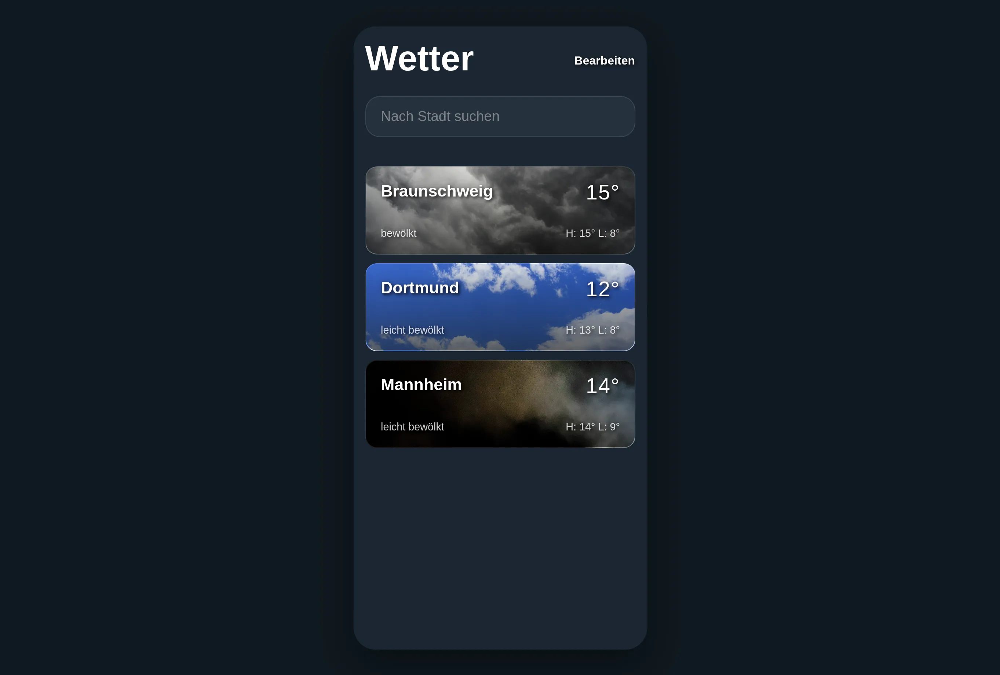

# 🌤️ Wetter-App (Modern Weather Forecast)

Ein hochperformantes Wetter-Dashboard, das Echtzeitdaten mit einem modernen Glassmorphism-Design kombiniert. Das Projekt demonstriert die saubere modulare Trennung von UI-Logik, API-Kommunikation und State-Management.

<picture>
  <source media="(prefers-color-scheme: dark)" srcset="public/img/screenshot-02.webp">
  <source media="(prefers-color-scheme: light)" srcset="public/img/screenshot-01.webp">
  
</picture>

## 🚀 Das Projekt

Diese Anwendung liefert präzise Wettervorhersagen über die WeatherAPI. Der Fokus lag auf einer immersiven Benutzererfahrung durch dynamische Hintergründe, die sich der aktuellen Wetterlage und Tageszeit anpassen, sowie einer intuitiven Favoritenverwaltung.

### 🛠 Tech-Stack

- **Frontend:** HTML5, SCSS (Sass mit Mixins & Grid)
- **Logik:** Modulares JavaScript (ES6 Modules)
- **Build-Tool:** **Vite** (für schnelles Development und optimierte Bundles)
- **API:** Integration der WeatherAPI (Forecast-Endpunkt)
- **Storage:** LocalStorage für persistente Nutzerdaten (Favoriten)
- **Assets:** Dynamisches Asset-Handling via `import.meta.glob`

### ✨ Key Features

- **Dynamisches UI-System:** Automatischer Wechsel der Hintergrundbilder basierend auf Wettercode und Tageszeit sowie ein bedingtes Hintergrund-Overlay für maximale Lesbarkeit.
- **Favoriten-Management:** Benutzer können Städte suchen, speichern und die Reihenfolge in der Liste über eine Sortier-Logik (Up/Down) individuell anpassen.
- **Skelett-Loader:** Implementierung von Shimmer-Effekten (`is-loading` States) für eine hochwertige wahrgenommene Performance während asynchroner Datenabrufe.
- **Modernes Glassmorphism-Design:** Nutzung von SCSS-Mixins für Backdrop-Blur-Effekte und korrigierte Hover-Animationen für flüssige Übergänge.
- **Optimierte UX:** Horizontales Scrollen für die Stunden-Vorhersage und automatisches Zeitformat-Handling (Umrechnung von AM/PM in das 24h-Format).

## 💡 Learning Outcomes

Dieses Projekt markiert einen vertieften Einstieg in die **modulare Softwarearchitektur**. Die App wurde konsequent in spezialisierte Module (`api.js`, `ui-search.js`, `local-storage.js`) unterteilt, was die Wartbarkeit und Skalierbarkeit im Vergleich zu monolithischen Skripten enorm steigert.

Besondere Schwerpunkte waren:
- **State-Management:** Synchronisation zwischen UI-Zustand und dem lokalen Speicher des Browsers.
- **Fortgeschrittenes CSS:** Lösung komplexer UI-Glitches, wie die Steuerung von Spezifität bei Mixins, um visuelle Fehler (Hover-Flimmern) zu vermeiden.
- **Asynchrone Orchestrierung:** Effiziente Abfolge von API-Calls für die Favoritenliste unter Berücksichtigung von Ladezuständen.

## ✍️ Kontakt
Frederik Anspach  
GitHub: [@frederikanspach](https://github.com/frederikanspach)  
Web: [frederikanspach.github.io](https://frederikanspach.github.io)
